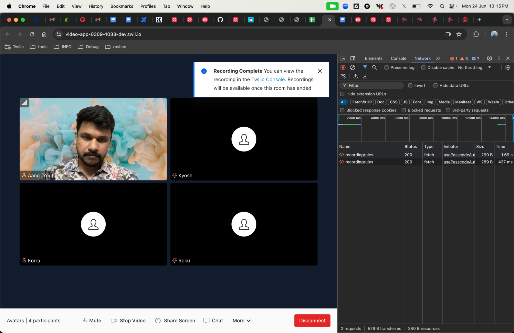

# Roshan's video-wheels-off

## Quickstart

**screenshots of the request inspector reporting the actions from the Quickstart room**


**screenshots of every "Example" explored in the Quickstart**

**Room SID :RM27ca449786e88e1c6beb8b272566fef5** 


**Set up the Video Demo React App on your laptop.
React Screen shots showing various actions with the Demo App**

Video Group room
Room Name: Avatars
SID: RMc0076da31213941de205c22641a00cd2



```Javascript
const accountSid = 'AC0fe10850d5dc75aba1068262c3cc6c8a';
const authToken = '';
const client = require('twilio')(accountSid, authToken);

const call = client.calls.create({
  from: "+447361584698",
  to: "Redacted",
  twiml: "<Response><Say>Ahoy, World!</Say><Connect><Room participantIdentity='Kuruk'>Avatars</Room></Connect></Response>",
});
```

Peer to Peer room


**Explain the differences Group rooms and P2P rooms.**

Twilio Video offers two distinct types of rooms for video communication: Group Rooms and Peer-to-Peer (P2P) Rooms. Group Rooms utilize server-based routing, where media streams are sent to Twilio's servers and then distributed to participants. This architecture supports larger groups by offloading the processing and bandwidth management to Twilio’s infrastructure, providing optimized media quality and the ability to handle complex network environments. Group Rooms also support server-side recording, making them ideal for larger meetings, webinars, and scenarios where recording the session is necessary. The centralized bandwidth usage and Twilio's media handling capabilities ensure a consistent and reliable experience for participants.

In contrast, P2P Rooms establish direct connections between participants without routing media through Twilio's servers. This approach can offer lower latency for smaller groups, typically up to 10 participants, as it eliminates the intermediary server. However, it requires each participant to maintain direct connections with every other participant, leading to higher bandwidth usage and potential issues with network configurations, such as firewalls and NAT. P2P Rooms are suitable for small team meetings, one-on-one calls, or situations where low latency is critical. They provide a straightforward setup but do not support server-side recording, making them less suitable for larger groups or scenarios needing advanced media processing and centralized control.


