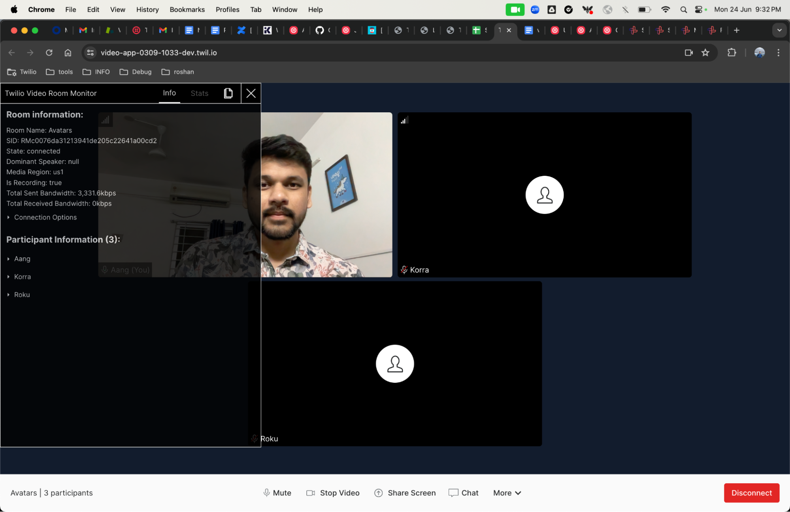
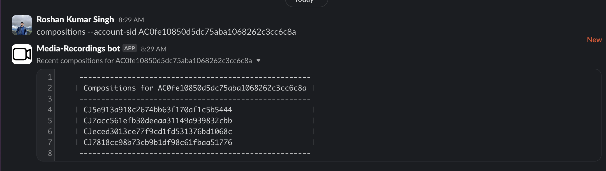

# Roshan's video-wheels-off

## Quickstart

**screenshots of the request inspector reporting the actions from the Quickstart room**


**screenshots of every "Example" explored in the Quickstart**

**Room SID :RM27ca449786e88e1c6beb8b272566fef5** 


**Set up the Video Demo React App on your laptop.
React Screen shots showing various actions with the Demo App**

Video Group room
Room Name: Avatars
SID: RMc0076da31213941de205c22641a00cd2





PSTN User added using twilio client.

```Javascript
const accountSid = '';
const authToken = '';
const client = require('twilio')(accountSid, authToken);

const call = client.calls.create({
  from: "+447361584698",
  to: "Redacted",
  twiml: "<Response><Say>Ahoy, World!</Say><Connect><Room participantIdentity='Kuruk'>Avatars</Room></Connect></Response>",
});
```

Peer to Peer room


**Explain the differences Group rooms and P2P rooms.**

Group Rooms utilize server-based routing, where media streams are sent to Twilio's servers and then distributed to participants. This architecture supports larger groups by offloading the processing and bandwidth management to Twilio’s infrastructure, providing optimized media quality and the ability to handle complex network environments. Group Rooms also support server-side recording, making them ideal for larger meetings, webinars, and scenarios where recording the session is necessary. The centralized bandwidth usage and Twilio's media handling capabilities ensure a consistent and reliable experience for participants.

In contrast, P2P Rooms establish direct connections between participants without routing media through Twilio's servers. This approach can offer lower latency for smaller groups, typically up to 10 participants, as it eliminates the intermediary server. However, it requires each participant to maintain direct connections with every other participant, leading to higher bandwidth usage and potential issues with network configurations, such as firewalls and NAT. P2P Rooms are suitable for small team meetings, one-on-one calls, or situations where low latency is critical. They provide a straightforward setup but do not support server-side recording, making them less suitable for larger groups or scenarios needing advanced media processing and centralized control.

**Compositions**

Create an audio-only composition.
Request
```
curl -X POST "https://video.twilio.com/v1/Compositions" \ 
--data-urlencode "AudioSources=RT3260a277e4fa97e66ba3a72eacc2b490" \
--data-urlencode "StatusCallback=https://webhook.site/6c34827f-29ed-407f-b86e-d20e9363f5e4" \                  
--data-urlencode "Format=mp4" \                                
--data-urlencode "RoomSid=RM09d0c0d0a767ce89c5c1a51f340ab774" \
-u $TWILIO_ACCOUNT_SID:$TWILIO_AUTH_TOKEN
```
Response
```Json
{"trim": true, "room_sid": "RM09d0c0d0a767ce89c5c1a51f340ab774", "duration": 0, "size": 0, "audio_sources_excluded": [],
"sid": "CJ7acc561efb30deeaa31149a939832cbb", "status_callback_method": "POST", "status": "enqueued", "format": "mp4", "bitrate": 0, "video_layout": {}, "date_completed": null, "url": "https://video.twilio.com/v1/Compositions/CJ7acc561efb30deeaa31149a939832cbb",
"media_external_location": null, "date_deleted": null, "account_sid": "AC0fe10850d5dc75aba1068262c3cc6c8a", "audio_sources": ["RT3260a277e4fa97e66ba3a72eacc2b490"], "date_created": "2024-06-26T13:38:33Z", "resolution": "640x480", "status_callback": "https://webhook.site/6c34827f-29ed-407f-b86e-d20e9363f5e4", "links": {"media": "https://video.twilio.com/v1/Compositions/CJ7acc561efb30deeaa31149a939832cbb/Media"}
```

Create a video grid composition

Request
```
VIDEO_LAYOUT_OBJ=$(cat << EOF
{
  "transcode": {"video_sources":["RT2bb84ef1da148a38b93456d1ded44457"]}
}
EOF
)
curl -X POST "https://video.twilio.com/v1/Compositions" \
--data-urlencode "VideoLayout=$VIDEO_LAYOUT_OBJ" \
--data-urlencode "StatusCallback=https://webhook.site/6c34827f-29ed-407f-b86e-d20e9363f5e4" \
--data-urlencode "Format=mp4" \
--data-urlencode "RoomSid=RM09d0c0d0a767ce89c5c1a51f340ab774" \
-u $TWILIO_ACCOUNT_SID:$TWILIO_AUTH_TOKEN
```
Response
```Json
{"trim": true, "room_sid": "RM09d0c0d0a767ce89c5c1a51f340ab774", "duration": 0, "size": 0, "audio_sources_excluded": [], "sid": "CJ5e913a918c2674bb63f170af1c5b5444",
 "status_callback_method": "POST", "status": "enqueued", "format": "mp4", "bitrate": 0, "video_layout": {"transcode": {"z_pos": 0, "reuse": "show_oldest", "x_pos": 0, "max_columns": null, "cells_excluded": [], "video_sources_excluded": [], "height": null, "width": null, "max_rows": null, "y_pos": 0, 
 "video_sources": ["RT2bb84ef1da148a38b93456d1ded44457"]}}, "date_completed": null, "url": "https://video.twilio.com/v1/Compositions/CJ5e913a918c2674bb63f170af1c5b5444", "media_external_location": null, "date_deleted": null, 
 "account_sid": "AC0fe10850d5dc75aba1068262c3cc6c8a", "audio_sources": [], "date_created": "2024-06-26T13:41:07Z", "resolution": "640x480", "status_callback": "https://webhook.site/6c34827f-29ed-407f-b86e-d20e9363f5e4", "links": {"media": "https://video.twilio.com/v1/Compositions/CJ5e913a918c2674bb63f170af1c5b5444/Media"}}
```
**Compositions files**


https://github.com/roshan-twi/video-wheels-off/assets/159227764/5009e5a6-117c-4ed1-a35c-b499925a8a6a


https://github.com/roshan-twi/video-wheels-off/assets/159227764/3ce34bec-7e59-42f8-8187-434f36f81a8b


**Programmable-Video Bot, Media Recordings Bot (Slack Apps)**




**Kibana**

Change Index to sdki-rooms* create a "Discover URL" that displays media region, codecs, vms server sid, whether the participant was "recorded on connect" for all of the participants in one of your group rooms.
https://kibana.us1.eak.twilio.com/video/goto/2fd49a782c60308244504462226b47b5


Change Index to video-insights* create a "Discover URL" that displays all device, manufacture, OS, browser version, SDK version information for the participants. 
https://kibana.us1.eak.twilio.com/video/goto/1a98e9340c757f5deb643174312a5994


Change Index to video-vms-reports* create a "Discover URL" that displays all actual bandwidth for each participant in one room
https://kibana.us1.eak.twilio.com/video/goto/8f3acacee9deb9d318c6c9caf0778c60


Change Index to video-voice-signaling* create a "Discover URL" that displays Participant SID, Call SID, Room SID, Identity, Room Name for the PSTN participant in one room. 
https://kibana.us1.eak.twilio.com/video/goto/957ab1ec137f2180eb2e4627777a6b84


Create a "Discover URL" that displays all the Network Quality scores for all participants in one of your group rooms
https://kibana.us1.eak.twilio.com/video/goto/95220a39e86554da63ddf35ee8b1d98c


visualization for the Network Quality Scores


**Quantico**
Using a SQL Query, find your API Request for the compositions you created.
```sql
select * from `qtco-customer-support.prod.app_api_api_access_last_14_days`
where (account_sid = 'Redacted' or parent_account_sid = 'Redacted')
and uri="/Compositions" order by timestamp desc
``` 


**Android Studio**


**XCode**


